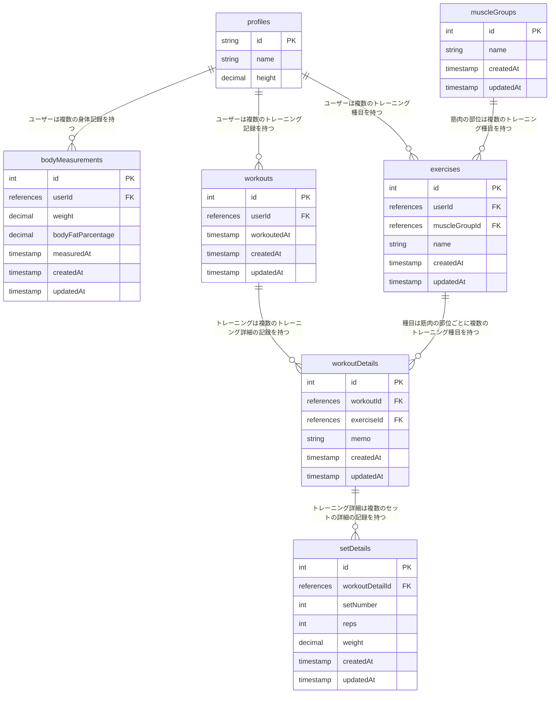

# FitTrack - 筋トレ記録プラットフォーム
 FitTrackは、筋トレの記録を簡単に管理できるプラットフォームです。 
 
 

 以下の特徴を提供しています:
 - **トレーニングデータの入力**: ユーザーは使用した重量、レップ数（回数）、セット数などのトレーニングデータを入力できます。
 - **グラフでの成長の可視化**: FitTrackはトレーニングごとの記録をグラフで表示し、ユーザーの成長を追跡できるようにします。
 - **モチベーションの維持**: 自分自身のモチベーションを高めるために、進捗の確認ができます。
 - **体重管理**: 体重と体脂肪を記録することができ、グラフで確認することができます。

# URL
 https://fit-track-seven.vercel.app/ 

# DB設計

# 使用技術
 - TypeScript
 - Next.js 14.1.0
 - React 18
 - Tailwindcss 3.3.0
 - Prisma 5.9.1
 - Supabase
 - PostgresSQL 3.4.3